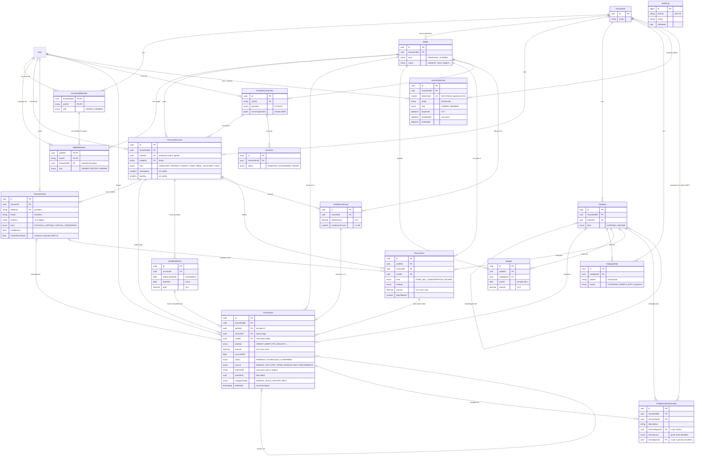

# Modelo de dados do FinTrack

Mapa das tabelas do domínio (M04). O schema completo, comentado campo a campo, está em
`packages/db/prisma/schema/`, um arquivo por assunto. As decisões estão no
[ADR-004](adr/0004-modelo-de-dados.md).

> Este diagrama é conferido por teste: `packages/db/src/docs-sync.test.ts` falha se um modelo
> do schema não aparecer aqui. Mudou o schema? Atualize o diagrama no mesmo PR.

## A ideia central: quem paga × de quem é

Todo lançamento responde três perguntas, cada uma numa coluna diferente:

| Pergunta   | Coluna                           | Exemplo                                      |
| ---------- | -------------------------------- | -------------------------------------------- |
| Quem paga? | `accountId`, `cardId` e `method` | fatura do Cartão Master, final 1003, crédito |
| De quem é? | `walletId` (o **ambiente**)      | "Casa"                                       |
| O que é?   | `categoryId`                     | Alimentação › Mercado                        |

Por isso a compra do mercado no cartão **adicional** de uma pessoa, que cai na fatura da
**titular**, pode ser um gasto do ambiente **Casa**. A fatura soma por conta; o ambiente
soma por `walletId`. As duas somas estão certas, porque respondem perguntas diferentes.

## Diagrama

O GitHub desenha o bloco abaixo como diagrama. Leia as linhas assim: `||--o{` é "um para
muitos" (um ambiente tem zero ou mais lançamentos); `|o--o{` é "zero ou um para muitos".

`AuditLog` não tem linhas no diagrama de propósito: não tem chave estrangeira, para o
registro sobreviver mesmo que a pessoa ou o grupo sejam apagados.

## O que é calculado, e não guardado

| Na planilha antiga                    | No FinTrack                                                      |
| ------------------------------------- | ---------------------------------------------------------------- |
| Abas "Despesas Fixas" e "Recorrentes" | lançamento com `recurrenceId` (o tipo está em `Recurrence.kind`) |
| "Despesa Parcelada", coluna "Parcela" | lançamento com `installmentGroupId` e `installmentNumber`        |
| "Despesa Variável"                    | lançamento sem recorrência e sem parcelamento                    |
| Status "PAGO" / "ABERTO" do cartão    | status da fatura (`CardStatement.status`)                        |
| Status "AGENDADO" / "REALIZADO"       | `status` SCHEDULED / CONFIRMED                                   |
| Integrante "CASAL"                    | ambiente compartilhado ("Casa")                                  |
| "Cartão Principal" e "Cartão"         | conta da fatura (`accountId`) e cartão usado (`cardId`)          |
| "Mês Referência" de compra no cartão  | `CardStatement.referenceMonth` da fatura da compra               |
| "Quem pagou" (M07.4)                  | `resolvePayer`: cartão conjunto, portador do cartão ou titular   |

## As travas que moram no banco

| Regra                                                                    | Onde                                                               |
| ------------------------------------------------------------------------ | ------------------------------------------------------------------ |
| O mesmo lançamento importado entra uma vez só                            | único `(accountId, source, externalId)`                            |
| Conta, ambiente, categoria e parcela de um lançamento são do mesmo grupo | chaves compostas com `householdId`                                 |
| O cartão é da conta do lançamento; a fatura também                       | chaves compostas `(cardId, accountId)`, `(statementId, accountId)` |
| Só quem é do grupo entra num ambiente do grupo                           | chave `(householdId, userId)` → `household_member`                 |
| Cartão guarda só os 4 últimos dígitos                                    | CHECK `payment_card_last_four_check`                               |
| Crédito só em cartão; vale só em vale-refeição; fatura só em cartão      | gatilho `transaction_method_matches_account`                       |
| Valor nunca é zero; importado sempre tem `externalId`                    | CHECKs de `transaction`                                            |
| Cartão tem fechamento e vencimento; as outras contas, não                | CHECK `financial_account_card_days_check`                          |
| Mês de orçamento e de fatura guardado como dia 1                         | CHECKs de `budget` e `card_statement`                              |
| A auditoria só acrescenta                                                | gatilho `audit_log_append_only`                                    |
| Convite guarda só o hash do segredo; e-mail em minúsculas (M06)          | CHECKs `household_invite_token_hash_check` e `_email_check`        |
| Convite não é aceito e cancelado ao mesmo tempo; prazo depois da criação | CHECKs `household_invite_state_check` e `_expiry_check`            |
| Nome de lar e de carteira com 1 a 60 caracteres (M06)                    | CHECKs `household_name_length_check` e `wallet_name_length_check`  |
| "Quem categorizou" só existe com categoria (M07)                         | CHECK `transaction_categorized_by_check`                           |
| Transferência não tem categoria (M07)                                    | CHECK `transaction_transfer_category_check`                        |
| Exemplo de treino é uma correção de verdade (M07)                        | CHECKs `categorization_example_change_check` e `_source_check`     |

Cada regra tem um teste em `packages/db/src/integration/`, que tenta quebrá-la contra o
PostgreSQL de verdade (`pnpm test:integration`).

## Quem vê o quê (M06)

O banco garante a fronteira do grupo (nada aponta para outro lar). **Quem dentro do lar pode
fazer o quê** é decidido no código, num ponto só: `authorizeWallet` e `authorizeHousehold`
(`packages/db/src/access.ts`), que leem o vínculo da pessoa e consultam a matriz de papéis
(`packages/core/src/access.ts`). A tabela completa está em [`permissoes.md`](permissoes.md).

## Lançamentos e categorização (M07)

- **Lançar** pede dois crachás: `edit` na carteira (de quem é) e o de **uso da conta** (quem
  paga), que vem de `edit` na carteira da conta ou de ser **portador** de um cartão dela (o
  adicional do cônjuge lança na fatura do titular, só com o próprio cartão).
- **`categorizedBy`** diz quem decidiu a categoria: a pessoa (`MANUAL`) ou a camada da cascata
  cuja sugestão ela aceitou (`RULE`, `HISTORY`). É de onde sai, no M10, o "percentual
  resolvido sem LLM". Lançamentos anteriores ao M07 ficam com nulo.
- **`categorization_example`** guarda cada **correção** (a sugestão ou a categoria gravada
  trocada por outra): o conjunto rotulado do classificador e do eval do M10.
- A cascata e o encaixe para IA estão no [ADR-007](adr/0007-lancamentos-e-categorizacao.md).

## Pago por, parcelas e despesas fixas (M07.4)

- **Pago por** não é coluna: sai do cartão (portador, ou Compartilhado quando
  `sharedPurchases` é verdadeiro) ou, sem cartão, do titular da conta. A regra está no core
  (`resolvePayer`) e no `WHERE` do filtro, conferidos juntos por um teste de integração.
- **Parcelada** vira um `InstallmentGroup` com N lançamentos, um por fatura (`CardStatement`
  único por conta e mês); a sobra de centavos vai na 1ª, as futuras nascem `SCHEDULED`.
- **Fixa** cria a `Recurrence` e o lançamento do mês com o mesmo `externalId` que a geração
  mensal usaria, então gerar o mês de novo não duplica.
- As decisões e o porquê estão no [ADR-009](adr/0009-pago-por-parcelas-e-fixas.md).

## Como ler o dinheiro

- **No banco:** `NUMERIC(14,2)`, com sinal: negativo saiu, positivo entrou.
- **No código:** `bigint` em centavos (`@fintrack/core`). A ponte é `toDbDecimal` e
  `fromDbDecimal` (`@fintrack/db`), sempre passando por texto, nunca por `number`.
- **Gasto do mês de um ambiente:** some por `walletId`, só o que tem `transferId` nulo,
  `deletedAt` nulo e `status` diferente de SCHEDULED. Transferência e pagamento de fatura
  mudam o dinheiro de lugar, não são gasto.
- **Fatura de um cartão:** some por `statementId` (competência) ou por `accountId` e
  `occurredOn` (quando a compra aconteceu). Os dois números são diferentes, e os dois certos.

## Como o modelo cresce sem reestruturar

Feature nova entra como **tabela nova**, **coluna opcional** ou **valor novo de enum**; uma
coluna nunca muda de significado; o que se calcula não é guardado. Planejadas desta forma:
investimentos, metas, limite de gastos com alerta, divisão dentro do ambiente com acerto de
contas, mês de referência manual e anexos. Veja a skill `prisma-migration`.
